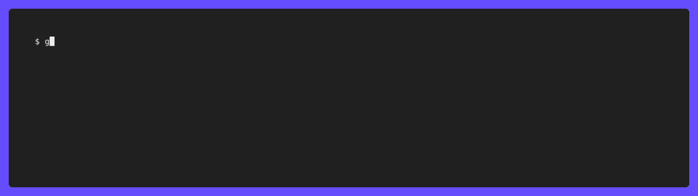

<!-- template:define:options
{
  "nodescription": true
}
-->


<!-- template:begin:header -->
<!-- do not edit anything in this "template" block, its auto-generated -->

<p align="center">
  <a href="https://github.com/lrstanley/go-ytdlp/tags">
    
  </a>
  <a href="https://github.com/lrstanley/go-ytdlp/commits/master">
    
  </a>


  <a href="https://github.com/lrstanley/go-ytdlp/actions?query=workflow%3Atest+event%3Apush">
    
  </a>


  <a href="https://codecov.io/gh/lrstanley/go-ytdlp">
    
  </a>

  <a href="https://pkg.go.dev/github.com/lrstanley/go-ytdlp">
    
  </a>
  <a href="https://goreportcard.com/report/github.com/lrstanley/go-ytdlp">
    
  </a>
</p>
<p align="center">
  <a href="https://github.com/lrstanley/go-ytdlp/issues?q=is:open+is:issue+label:bug">
    
  </a>
  <a href="https://github.com/lrstanley/go-ytdlp/issues?q=is:open+is:issue+label:enhancement">
    
  </a>
  <a href="https://github.com/lrstanley/go-ytdlp/pulls">
    
  </a>
  <a href="https://github.com/lrstanley/go-ytdlp/discussions/new?category=q-a">
    
  </a>
  <a href="https://liam.sh/chat"></a>
</p>
<!-- template:end:header -->

<!-- template:begin:toc -->
<!-- do not edit anything in this "template" block, its auto-generated -->
## :link: Table of Contents

  - [Features](#sparkles-features)
    - [Help Documentation Example](#sparkles-help-documentation-example)
  - [Usage](#gear-usage)
  - [Examples](#clap-examples)
    - [Simple](#simple)
    - [Fancy UI using BubbleTea](#fancy-ui-using-bubbletea)
  - [Install Function(s) &amp; Binary Management](#package-install-functions--binary-management)
    - [yt-dlp](#yt-dlp)
    - [ffmpeg &amp; ffprobe](#ffmpeg--ffprobe)
    - [bun](#bun)
  - [FlagConfig: JSON to/from Flags Conversion &amp; Usage](#flagconfig-json-tofrom-flags-conversion--usage)
  - [Support &amp; Assistance](#raising_hand_man-support--assistance)
  - [Contributing](#handshake-contributing)
  - [License](#balance_scale-license)
<!-- template:end:toc -->

## :sparkles: Features

- CLI bindings for yt-dlp -- including all flags/commands.
- Optional `Install*` helpers to auto-download the latest supported version of
  yt-dlp, ffmpeg, ffprobe and bun, including proper checksum validation for secure downloads (yt-dlp only).
  - Worry less about making sure yt-dlp is installed wherever **go-ytdlp** is running from!
- Carried over help documentation for all functions/methods.
- Flags with arguments have type mappings according to what the actual flags expect.
- Completely generated, ensuring it's easy to update to future **yt-dlp** versions.
- Deprecated flags are marked as deprecated in a way that should be caught by most IDEs/linters.
- Stdout/Stderr parsing, with timestamps, and optional JSON post-processing.

### :sparkles: Help Documentation Example


---

## :gear: Usage

<!-- template:begin:goget -->
<!-- do not edit anything in this "template" block, its auto-generated -->
```console
go get -u github.com/lrstanley/go-ytdlp@latest
```
<!-- template:end:goget -->

## :clap: Examples

### Simple

See also [_examples/simple/main.go](./_examples/simple/main.go), which includes
writing results (stdout/stderr/etc) as JSON.

```go
package main

import (
	"context"

	"github.com/lrstanley/go-ytdlp"
)

func main() {
	// If yt-dlp isn't installed yet, download and cache it for further use.
	ytdlp.MustInstall(context.TODO(), nil)

	dl := ytdlp.New().
		FormatSort("res,ext:mp4:m4a").
		RecodeVideo("mp4").
		Output("%(extractor)s - %(title)s.%(ext)s")

	_, err := dl.Run(context.TODO(), "https://www.youtube.com/watch?v=dQw4w9WgXcQ")
	if err != nil {
		panic(err)
	}
}
```

### Fancy UI using BubbleTea

This example shows how to use **go-ytdlp** and [BubbleTea](https://github.com/charmbracelet/bubbletea)
to create a fancy, though relatively simple, UI for downloading videos.



Source: [bubble-dl](./_examples/bubble-dl)

---

## :package: Install Function(s) & Binary Management

The `Install*` function helpers in **go-ytdlp** allow you to automatically download and cache the
required binaries (`yt-dlp`, `ffmpeg`, `ffprobe` and `bun`) for your platform. This makes it easy to get
started without manually installing these dependencies, and ensures the correct versions are used.

> **Note:** Download/installation of `ffmpeg`, `ffprobe` and `bun` is only supported on a handful of platforms.
> It is still recommended to install them via other means if your platform is not listed below.

### yt-dlp

| OS/Arch         | Download Source                  |
|-----------------|----------------------------------|
| darwin_amd64    | https://github.com/yt-dlp/yt-dlp |
| darwin_arm64    | https://github.com/yt-dlp/yt-dlp |
| linux_amd64     | https://github.com/yt-dlp/yt-dlp |
| linux_arm64     | https://github.com/yt-dlp/yt-dlp |
| linux_armv7l    | https://github.com/yt-dlp/yt-dlp |
| windows_amd64   | https://github.com/yt-dlp/yt-dlp |

### ffmpeg & ffprobe

| OS/Arch       | ffmpeg/ffprobe Download Source          |
|---------------|-----------------------------------------|
| darwin_amd64  | https://evermeet.cx/ffmpeg/             |
| linux_amd64   | https://github.com/yt-dlp/FFmpeg-Builds |
| linux_arm64   | https://github.com/yt-dlp/FFmpeg-Builds |
| windows_amd64 | https://github.com/yt-dlp/FFmpeg-Builds |
| windows_arm   | https://github.com/yt-dlp/FFmpeg-Builds |

### bun

| OS/Arch       | bun Download Source                                                            |
|---------------|--------------------------------------------------------------------------------|
| darwin_amd64  | https://github.com/oven-sh/bun/releases/latest/download/bun-darwin-x64.zip     |
| darwin_arm64  | https://github.com/oven-sh/bun/releases/latest/download/bun-darwin-aarch64.zip |
| linux_amd64   | https://github.com/oven-sh/bun/releases/latest/download/bun-linux-x64.zip      |
| linux_arm64   | https://github.com/oven-sh/bun/releases/latest/download/bun-linux-aarch64.zip  |
| windows_amd64 | https://github.com/oven-sh/bun/releases/latest/download/bun-windows-x64.zip    |

#### Using a different JS runtime

Multiple JavaScript runtimes are supported by yt-dlp, but they are disabled by default. You can add a different runtime to the list of enabled ones using `.JsRuntimes("node")` or clear the list using `.NoJsRuntimes()`. If no options are set, bun will be [enabled by default](command.go#L198).

Refer to the [official documentation](https://github.com/yt-dlp/yt-dlp/wiki/EJS) for more information.

## FlagConfig: JSON to/from Flags Conversion & Usage

The `FlagConfig` type in **go-ytdlp** enables conversion between JSON and yt-dlp command-line flags.
This is useful for scenarios such as HTTP APIs, web UIs, or persisting flag configurations in a database.

- **Bidirectional Conversion:** Easily marshal and unmarshal yt-dlp flags to and from JSON. Use
  `Command.SetFlagConfig` and `Command.GetFlagConfig` to set/get the flag config.
- **Validation:** Use the provided validation functions and JSON schema to ensure correctness. The
  JSON body allows duplicate flags (unless using the provided json schema), so always validate before use.
- **JSON Schema:** The schema (available via the `optiondata.JSONSchema` variable and also
  [located here](./optiondata/json-schema.json)) can be used for type generation in other languages (e.g.
  TypeScript) and for client-side validation (e.g. using something like [json-schema-to-zod](https://www.npmjs.com/package/json-schema-to-zod)
  when working with a web UI).
- **Persistence:** If storing flag configs in a database, note that yt-dlp flags can change or be removed
  at any time (in correlation to updates of **go-ytdlp**). Always validate after loading from storage.
  - If validation fails, clear the invalid values in the JSON before retrying (e.g. using the
    `ErrMultipleJSONParsingFlags` and `ErrJSONParsingFlag` error types, which include the path in the
    JSON where the issue occurred).
- **SupportedExtractors:** If persisting the values from this generated type, remember that extractors
  can be changed or removed by yt-dlp at any time (in correlation to updates of **go-ytdlp**). If a
  user requests a retry and the extractor is missing, consider defaulting to `generic` or another fallback.
- **Intended Usage:** `FlagConfig` is designed for JSON marshalling/unmarshalling only. It is not intended
  for direct use in Go code unless you are building HTTP servers, persisting configs, or similar use cases.
  The builder pattern should be used in all other cases.

### Example: HTTP Server which Invokes `go-ytdlp`

You can find an example of how to use the `FlagConfig` type for HTTP server integration in the
[`_examples/http-server`](./_examples/http-server) directory.

---

<!-- template:begin:support -->
<!-- do not edit anything in this "template" block, its auto-generated -->
## :raising_hand_man: Support & Assistance

* :heart: Please review the [Code of Conduct](.github/CODE_OF_CONDUCT.md) for
     guidelines on ensuring everyone has the best experience interacting with
     the community.
* :raising_hand_man: Take a look at the [support](.github/SUPPORT.md) document on
     guidelines for tips on how to ask the right questions.
* :lady_beetle: For all features/bugs/issues/questions/etc, [head over here](https://github.com/lrstanley/go-ytdlp/issues/new/choose).
<!-- template:end:support -->

<!-- template:begin:contributing -->
<!-- do not edit anything in this "template" block, its auto-generated -->
## :handshake: Contributing

* :heart: Please review the [Code of Conduct](.github/CODE_OF_CONDUCT.md) for guidelines
     on ensuring everyone has the best experience interacting with the
    community.
* :clipboard: Please review the [contributing](.github/CONTRIBUTING.md) doc for submitting
     issues/a guide on submitting pull requests and helping out.
* :old_key: For anything security related, please review this repositories [security policy](https://github.com/lrstanley/go-ytdlp/security/policy).
<!-- template:end:contributing -->

<!-- template:begin:license -->
<!-- do not edit anything in this "template" block, its auto-generated -->
## :balance_scale: License

```
MIT License

Copyright (c) 2023 Liam Stanley <liam@liam.sh>

Permission is hereby granted, free of charge, to any person obtaining a copy
of this software and associated documentation files (the "Software"), to deal
in the Software without restriction, including without limitation the rights
to use, copy, modify, merge, publish, distribute, sublicense, and/or sell
copies of the Software, and to permit persons to whom the Software is
furnished to do so, subject to the following conditions:

The above copyright notice and this permission notice shall be included in all
copies or substantial portions of the Software.

THE SOFTWARE IS PROVIDED "AS IS", WITHOUT WARRANTY OF ANY KIND, EXPRESS OR
IMPLIED, INCLUDING BUT NOT LIMITED TO THE WARRANTIES OF MERCHANTABILITY,
FITNESS FOR A PARTICULAR PURPOSE AND NONINFRINGEMENT. IN NO EVENT SHALL THE
AUTHORS OR COPYRIGHT HOLDERS BE LIABLE FOR ANY CLAIM, DAMAGES OR OTHER
LIABILITY, WHETHER IN AN ACTION OF CONTRACT, TORT OR OTHERWISE, ARISING FROM,
OUT OF OR IN CONNECTION WITH THE SOFTWARE OR THE USE OR OTHER DEALINGS IN THE
SOFTWARE.
```

_Also located [here](LICENSE)_
<!-- template:end:license -->
